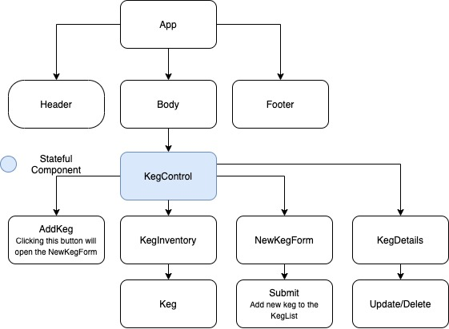

# CRUD 'N' Suds

### "React Fundamentals Project for Epicodus 2.12.21"

#### by Kevin Kirkley

## Description
CRUD N Suds is the newest programming-themed bar in the Portland Area so this project was developed to help the crew manage their ever-changing taplist and track their inventory as pints are sold. This program has full CRUD functionality with the ability to Create, Read, Update and Delete kegs within their system.

## User Stories
* As a user, I want to see a list/menu of all available kegs. For each keg, I want to see its name, brand, price and alcoholContent.
* As a user, I want to submit a form to add a new keg to a list.
* As a user, I want to be able to click on a keg to see its detail page.
* As a user, I want to see how many pints are left in a keg.
* As a user, I want to be able to click a button next to a keg whenever I sell a pint of it. This should decrease the number of pints left by 1. Pints should not be able to go below 0.
* As a user, I want the option to edit a keg's properties after entering them just in case I make a mistake.
* As a user, I want to be able to delete a keg.
* As a user, I want a keg to update to say "Out of Stock" once it's empty.

## Program Structure




### Software Requirements
1. Internet Browser
2. A code editor such as VSCode in order to view or edit codebase. 
3. Node.js

### Open by downloading:
1. Download the [repository](https://github.com/kevinkirkl3y/crud-n-suds.git) onto your computer by clicking the 'clone or download button'.
2. Open within your text editor and navigate to the `crud-n-suds` folder and run `npm install` in your console to install project dependencies.
3. Run `npm start` in your console to fire up the program and then open in your browser. 

### Open with Bash/GitBash:
1. Clone this repository onto your computer: 
```
git clone https://github.com/kevinkirkl3y/crud-n-suds.git
```
2. Navigate into the `crud-n-suds` directory and open in VSCode or preferred text editor using `code .` in your terminal.
3. Open within your text editor and navigate to the `crud-n-suds` folder and run `npm install` in your console to install all project dependencies.
4. Run `npm start` in your console to fire up the program and then open in your browser.

### `npm start`

Runs the app in the development mode.\
Open [http://localhost:3000](http://localhost:3000) to view it in the browser.

The page will reload if you make edits.\
You will also see any lint errors in the console.


### `npm run build`

Builds the app for production to the `build` folder.\
It correctly bundles React in production mode and optimizes the build for the best performance.a

## Known Bugs / Issues

* None currently to note

## Support / Contact Details

_Contact Kevin Kirkley at [kevinmkirkley@gmail.com](mailto:kevinmkirkley@gmail.com) with and questions, concerns or additions._

## Technologies Used

<details>
  <summary>Expand Tech/tools</summary>

* [Bootstrap Components](https://getbootstrap.com/docs/3.3/components/)
* Javascript
* React
* CSS
* Node.js
* Google Fonts

</details>

## ©️ License & Copyright

[](https://opensource.org/licenses/MIT)

Copyright (c) 2020 **_Kevin Kirkley_**
